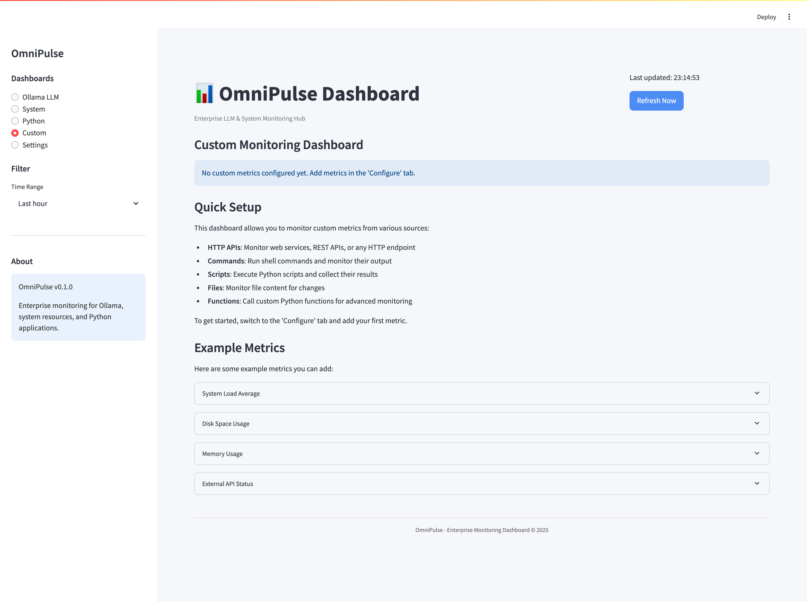

# OmniPulse: Enterprise LLM & System Monitoring Hub

<div align="center">
  
  <h3>Real-time enterprise monitoring solution for LLMs, Python applications, and system resources</h3>
  <p>
    <a href="#key-features">Features</a> •
    <a href="#installation">Installation</a> •
    <a href="#quick-start">Quick Start</a> •
    <a href="#configuration">Configuration</a> •
    <a href="#dashboards">Dashboards</a> •
    <a href="#architecture">Architecture</a> •
    <a href="#contributing">Contributing</a>
  </p>
</div>

## 📋 Overview

OmniPulse is a comprehensive real-time monitoring dashboard built with Streamlit that provides enterprise-grade insights into Ollama LLM usage, Python applications, system resources, and custom metrics. Designed for both development and production environments, OmniPulse helps you track, visualize, and optimize your infrastructure performance with an intuitive and customizable interface.

## 🔑 Key Features

### 🤖 Ollama LLM Monitoring
- **Model Performance Tracking**: Monitor inference latency, tokens per second, and throughput
- **Resource Utilization**: Track GPU/CPU usage, memory consumption, and cache efficiency
- **Request Analysis**: Visualize request patterns, token usage, and model distribution
- **Error Monitoring**: Capture and analyze inference errors and timeouts
- **Model Management**: Track model versions, downloads, and usage statistics


### 🖥️ System Resource Monitoring
- **CPU Analytics**: Real-time CPU utilization by core with historical trends
- **Memory Management**: Track RAM usage, swap activity, and memory-intensive processes
- **Disk Performance**: Monitor I/O operations, disk usage, and read/write latency
- **Network Activity**: Visualize bandwidth usage, connection counts, and packet metrics
- **Temperature & Power**: Track thermal performance and power consumption (where supported)


### 🐍 Python Application Monitoring
- **Process Tracking**: Monitor Python processes with resource usage details
- **Memory Analysis**: Detect memory leaks and abnormal memory consumption patterns
- **Performance Metrics**: Track execution time, thread counts, and file descriptors
- **Error Logging**: Capture and visualize Python exceptions and errors
- **Dependency Management**: Monitor installed packages and version conflicts


### 🛠️ Custom Metrics Framework
- **API Integration**: Connect to external metrics sources with a flexible API
- **Custom Dashboards**: Create personalized views for specific monitoring needs
- **Visualization Builder**: Drag-and-drop interface for building custom charts
- **Alert Configuration**: Set custom thresholds and notification rules
- **Data Export**: Export metrics and visualizations for reporting



### ⚙️ Advanced Features
- **Role-Based Access Control**: Secure your dashboard with multi-user authentication
- **Dark/Light Themes**: Choose your preferred visual mode for comfortable viewing
- **Responsive Design**: Access your dashboard from desktop or mobile devices
- **Data Persistence**: Store historical metrics with configurable retention periods
- **Notification System**: Receive alerts via email, webhook, or in-app notifications


## 🚀 Installation

### Prerequisites
- Python 3.8 or higher
- Pip package manager
- Ollama (for LLM monitoring)
- Git (for cloning the repository)

### Installation Options

#### Option 1: Quick Setup (Recommended)
```bash
# Clone the repository
git clone https://github.com/vishalm/omnipulse.git
cd omnipulse

# Run the setup script
./setup.sh

# Start the dashboard
./run.sh
```

#### Option 2: Manual Installation
```bash
# Clone the repository
git clone https://github.com/vishalm/omnipulse.git
cd omnipulse

# Create virtual environment
python -m venv venv
source venv/bin/activate  # On Windows: venv\Scripts\activate

# Install dependencies
pip install -r requirements.txt

# Start the dashboard
streamlit run src/app.py
```

## ⚡ Quick Start

After installation, the dashboard will be accessible at `http://localhost:8501` by default.

### Default Login Credentials
If authentication is enabled, use these default credentials:
- Username: `admin`
- Password: `omnipulse`

It's highly recommended to change these credentials immediately in the settings.

### First-Time Setup
1. Connect to your Ollama instance by configuring the API endpoint
2. Set up system monitoring by selecting which metrics to track
3. Configure Python application monitoring by adding your app processes
4. Create your first custom dashboard with the metrics that matter most to you

## ⚙️ Configuration

OmniPulse can be configured via the UI or by editing the `.env` file directly:

### Environment Configuration

```
# Ollama Configuration
OLLAMA_API_URL=http://localhost:11434

# Data Collection Settings
REFRESH_INTERVAL=5  # seconds
HISTORY_RETENTION=24  # hours

# System Monitor Configuration
ENABLE_CPU_MONITORING=true
ENABLE_MEMORY_MONITORING=true
ENABLE_DISK_MONITORING=true
ENABLE_NETWORK_MONITORING=true

# Authentication (Optional)
ENABLE_AUTHENTICATION=false
#AUTH_USERNAME=admin
#AUTH_PASSWORD_HASH=  # Generate with password_hasher.py

# Alert Configuration
ENABLE_ALERTS=true
ALERT_EMAIL=  # Optional email for notifications
CPU_ALERT_THRESHOLD=90  # percentage
MEMORY_ALERT_THRESHOLD=85  # percentage
DISK_ALERT_THRESHOLD=90  # percentage
```

### Advanced Configuration

For advanced configurations, edit the JSON config files located in the `src/config` directory:

- `dashboards.json`: Configure dashboard layouts and widgets
- `monitors.json`: Configure data collection parameters for each monitor
- `alerts.json`: Configure alert thresholds and notification settings
- `themes.json`: Customize UI themes and visual elements

## 📊 Dashboards

OmniPulse provides four main dashboards:

### Ollama LLM Dashboard
The Ollama dashboard provides comprehensive monitoring for your Ollama LLM instance, including:
- Model usage statistics and performance metrics
- Request volume and latency visualizations
- Token usage and throughput analytics
- Memory consumption and resource utilization
- Error rate and exception tracking

### System Dashboard
The System dashboard gives you a complete view of your hardware performance:
- CPU utilization by core with historical trends
- Memory usage breakdown with process details
- Disk utilization and I/O performance metrics
- Network traffic analysis and connection stats
- System temperature and power consumption (where available)

### Python Apps Dashboard
Monitor your Python applications with detailed performance metrics:
- Process resource usage and thread analysis
- Memory allocation and potential leak detection
- File descriptor management and I/O operations
- Exception tracking and error frequency analysis
- Dependency management and environment details

### Custom Dashboard
Create personalized monitoring views with the metrics that matter most to you:
- Drag-and-drop widget configuration
- Flexible layout options for optimal visualization
- Custom metric integration via API
- Alert configuration and threshold management
- Dashboard sharing and export capabilities

## 🏗️ Architecture

OmniPulse follows a modular architecture that ensures extensibility and maintainability:

```
omnipulse/
├── src/                        # Source code
│   ├── app.py                  # Main Streamlit application
│   ├── config/                 # Configuration management
│   │   ├── settings.py         # Settings handler
│   │   ├── defaults.py         # Default configurations
│   │   └── themes.py           # UI theme management
│   ├── core/                   # Core functionality
│   │   ├── auth.py             # Authentication system
│   │   ├── cache.py            # Data caching
│   │   └── database.py         # Metrics storage
│   ├── dashboards/             # Dashboard components
│   │   ├── ollama_dashboard.py # Ollama LLM dashboard
│   │   ├── system_dashboard.py # System resources dashboard
│   │   ├── python_dashboard.py # Python apps dashboard
│   │   └── custom_dashboard.py # Custom metrics dashboard
│   ├── monitors/               # Data collection modules
│   │   ├── ollama_monitor.py   # Ollama metrics collection
│   │   ├── system_monitor.py   # System metrics collection
│   │   ├── python_monitor.py   # Python app metrics
│   │   └── custom_monitor.py   # Custom metrics collection
│   ├── utils/                  # Utilities
│   │   ├── visualization.py    # Chart generation
│   │   ├── alerts.py           # Alert system
│   │   └── helpers.py          # Helper functions
│   └── widgets/                # UI components
│       ├── metric_cards.py     # Metric display cards
│       ├── charts.py           # Chart components
│       └── controls.py         # UI controls
├── tests/                      # Test suite
├── requirements.txt            # Dependencies
├── setup.sh                    # Setup script
├── run.sh                      # Run script
└── README.md                   # This file
```

### Data Flow

1. **Collection**: Monitor modules collect metrics from various sources
2. **Processing**: Raw data is processed and stored in the metrics database
3. **Visualization**: Dashboard components query the database and render visualizations
4. **Alerting**: Alert system continuously checks metrics against thresholds
5. **User Interface**: Streamlit renders the UI with real-time updates

## 🔄 Development Workflow

### Setting Up Development Environment
```bash
# Clone the repository
git clone https://github.com/vishalm/omnipulse.git
cd omnipulse

# Create virtual environment
python -m venv venv
source venv/bin/activate  # On Windows: venv\Scripts\activate

# Install development dependencies
pip install -r requirements-dev.txt

# Run tests
pytest
```

### Adding Custom Monitors
OmniPulse supports custom monitors for any application or service:

1. Create a new monitor module in `src/monitors/`
2. Implement the `Monitor` interface with your data collection logic
3. Register your monitor in the configuration
4. Create a corresponding dashboard component in `src/dashboards/`

## 🧪 Testing

OmniPulse includes comprehensive tests for all components:

- **Unit Tests**: Test individual functions and classes
- **Integration Tests**: Test interactions between components
- **UI Tests**: Test dashboard rendering and user interactions

Run the test suite with:
```bash
pytest
```

## 🤝 Contributing

Contributions are welcome! Please feel free to submit a Pull Request.

1. Fork the repository
2. Create your feature branch (`git checkout -b feature/amazing-feature`)
3. Commit your changes (`git commit -m 'Add some amazing feature'`)
4. Push to the branch (`git push origin feature/amazing-feature`)
5. Open a Pull Request

Please ensure your code passes all tests and follows the project's coding standards.

## 📝 License

This project is licensed under the MIT License - see the LICENSE file for details.

## 🙏 Acknowledgements

- [Streamlit](https://streamlit.io/) for the amazing web framework
- [Plotly](https://plotly.com/) for interactive visualizations
- [Ollama](https://ollama.ai/) for the local LLM runtime
- [psutil](https://github.com/giampaolo/psutil) for system monitoring capabilities
- [APScheduler](https://github.com/agronholm/apscheduler) for scheduled data collection

## 📞 Support

If you encounter any issues or have questions about OmniPulse, please open an issue on GitHub or contact the development team at support@example.com.

---

<div align="center">
  <p>Built with ❤️ by <a href="https://github.com/vishalm">Your Team</a></p>
  <p>
    <a href="https://github.com/vishalm/omnipulse/stargazers">⭐ Star us on GitHub</a> •
    <a href="https://twitter.com/vishalm">Follow us on Twitter</a>
  </p>
</div>


## HACK for env for Python 3.12.0
Perfect — here’s exactly what you need to do on your **MacBook running Python 3.12** to fix the `distutils` error caused by `GPUtil`.

---

### ✅ Step-by-Step Fix (Recommended): Patch `GPUtil` to replace `distutils`

#### 🔧 1. Locate the problematic file
```bash
open venv/lib/python3.12/site-packages/GPUtil/GPUtil.py
```

Or open it manually in your editor:
```
/Users/vishal.mishra/workspace/self/omnipulse/venv/lib/python3.12/site-packages/GPUtil/GPUtil.py
```

#### 🔧 2. Edit the import

**Replace this line:**
```python
from distutils import spawn
```

**With:**
```python
import shutil
```

#### 🔧 3. Update function calls

**Replace:**
```python
spawn.find_executable("nvidia-smi")
```

**With:**
```python
shutil.which("nvidia-smi")
```

You may find multiple `spawn.find_executable()` calls — replace them all with `shutil.which()`.

#### ✅ 4. Save and rerun your app
You should now be able to run your code with Python 3.12 and `GPUtil` will work fine.

---

### 💡 Bonus: Want to automate this patch?

Here's a quick terminal one-liner to auto-patch it:

```bash
sed -i '' 's/from distutils import spawn/import shutil/; s/spawn.find_executable/shutil.which/g' venv/lib/python3.12/site-packages/GPUtil/GPUtil.py
```

---

Let me know if you want to downgrade to Python 3.11 with `pyenv` instead — happy to walk you through that too.